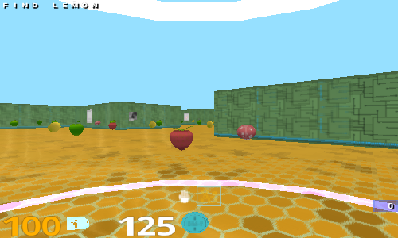
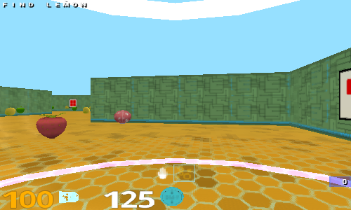

## Implementation of the paper Grounded Language Learning in a Simulated 3D World in PyTorch

### Requirements:
- Python 2.7
- Pytorch
- Bazel (to build DeepMind Lab)

### Usage:
To run the custom learning environment, run the following command:

`` bazel run :learning_agent ``

### Reinforcement Learning agent:
The goal of the paper is to teach the agent to do specific tasks using natural language command and visual input, for example in this implementation:
`` Find apples ``
`` Find strawberries ``

Visual input:

### Milestones:

**1.** Setting up agent environment:
- [x] Generate custom map
- [x] Generate scoring logic for training
- [x] Generate natural language commands

**2.** Build the RL model in pytorch
- [x] Baseline Actor-Critic RL agent
- [x] Neural Network Modules Implementation (Vison, Language, Mixing, Action, Policy)
- [x] Tested baseline implementation
- [x] Implement auxiliary tasks (temporal AutoEncoder, Language Predictor, Reward Predictor)
- [x] Implement training loop with experience replay 

**3.** Train the agent
- [ ] Implement distributed training
- [ ] Run on GPU instance (it takes too much for my CPU to perform just one update, the code would need to be optimized further)
- [ ] Monitor and compare results with DeepMind (It'll be awesome if I can achieve comparable results)

