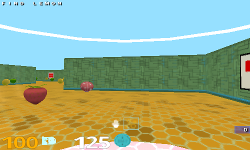

## Implementation of the paper Grounded Language Learning in a Simulated 3D World in PyTorch

### Requirements:
- Python 2.7
- Pytorch
- Bazel (to build DeepMind Lab)

### Usage:
To train the agent on the custom learning environment, run the following command:

`` bazel run :learning_agent ``

To run in human mode:

`` bazel run :game -- --level_script language_learning``

Agent code is in the folder [python/rl_agent](python/rl_agent)

Environment code is written in Lua [assets/game_scripts/language_learning.lua](assets/game_scripts/language_learning.lua) 

### Reinforcement Learning agent:
The goal of the paper is to teach the agent to do specific tasks using natural language command and visual input, for example in this implementation:
`` Find apples `` or 
`` Find strawberries ``

The agent will receive positive points for picking specified object, and negative points for other objects. Optimization step is performed when the replay memory buffer is full, and then cleared. 

Visual input:

### Milestones:

**1.** Setting up agent environment:
- [x] Generate custom map
- [x] Generate scoring logic for training
- [x] Generate natural language commands

**2.** Build the RL model in pytorch
- [x] Baseline Actor-Critic RL agent
- [x] Neural Network Modules Implementation (Vison, Language, Mixing, Action, Policy)
- [x] Tested baseline implementation
- [x] Implement auxiliary tasks (temporal AutoEncoder, Language Predictor, Reward Predictor)
- [x] Implement training loop with experience replay 

**3.** Train the agent
- [ ] Implement distributed training
- [ ] Run on GPU instance (it takes too much for my CPU to perform just one update, the code would need to be optimized further)
- [ ] Monitor and compare results with DeepMind (It'll be awesome if I can achieve comparable results)
- [ ] Implement more complex training scenarios, relational commands, etc.

